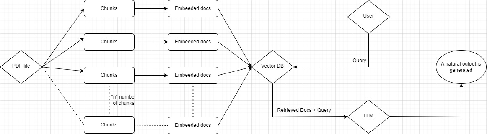

## Chatbot-JC

### Instructions

1. First you need to create API Keys:
For Groq: Go to this website(https://console.groq.com/playground) and on the API keys tab you can create the API Key.
For Google: Go to this website(https://aistudio.google.com/app/apikey) and on the get API key tab you can create the API key.

2. Create a .env file and store these API keys
GOOGLE_API_KEY = "your api key"
GROQ_API_KEY = "your api key"

3. And simply run the python file in terminal -- streamlit run "path of the app.py file"

4.The pdf is stored in the Data folder, currently this code uses only one pdf.

5.I am using the "mixtral-8x7b-32768" model as my LLM

